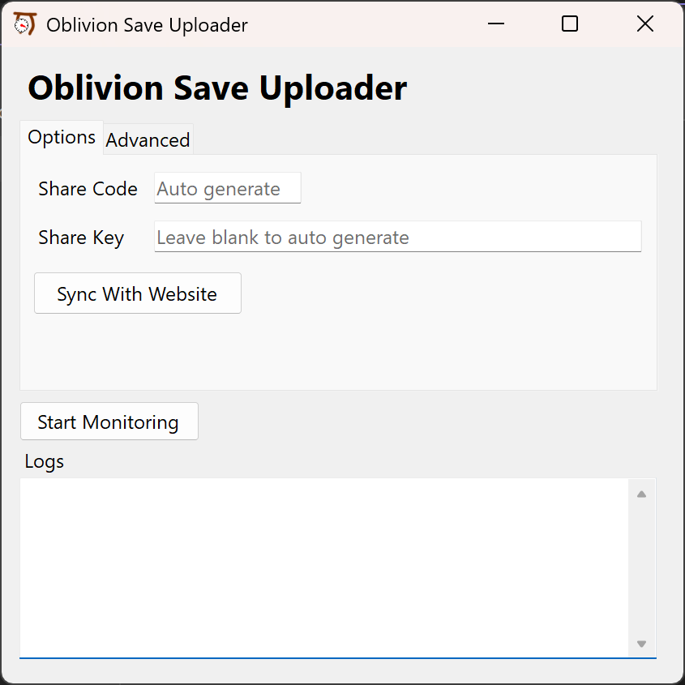
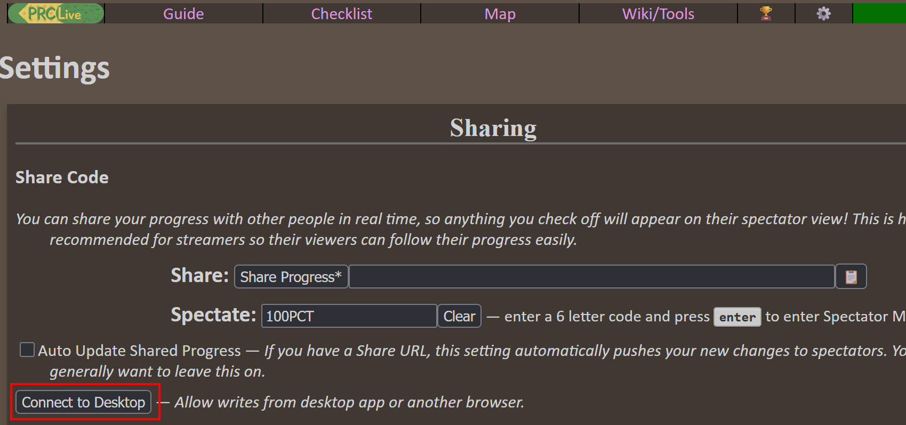

# Oblivion Save Progress Uploader
Track local oblivion progress on the [Interactive Oblivion Progress Tracker](https://michaelebert.github.io/OblivionProgressTracker/index.html) in real-time.

# Instructions

1. Download the [dotnet 8 redistributable](https://dotnet.microsoft.com/en-us/download/dotnet/8.0)
2. Download OblivionSaveUploader.zip from the [Latest Release](https://github.com/MichaelEbert/OblivionSaveReaderCS/releases/latest/), unzip, and open app.
3. (Optional) Sync with existing interactive checklist:
   1. Copy 6-digit share code into "share code" field
   2. press "Sync With Website"
   3. On [Settings page](https://oblivion.azuriteforest.net/guide/settings.html), press "Connect to Desktop": 
4. Press "Start Monitoring"
5. (optional) To simulate a new save, copy and paste a save file in the oblivion save directory. It should show up as "uploaded" in the app.
